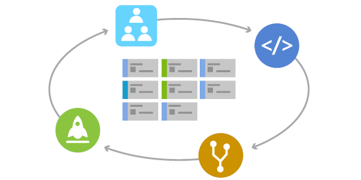

# Welcome to Agile

#### Your guide through the theory and application of Agile

## What is Agile

###### Agile approaches software development by emphasizing incremental delivery, team collaboration, continual planning, and continual learning.

###### [Read more \>](what-is-agile.md)

## What is Agile Development?

Agile Development takes Agile principles and applies them software
engineering.

[Read more \>](https://visualstudio.com/learn/what-is-agile-development)

## Building Agile Culture

Agile culture means more than performing Agile practices. It is not a
“thing” you do. It is a mindset.

[Read more \>](agile-culture.md)

## What is Scrum?

Scrum is a popular framework for managing development projects. Possibly
the most popular. Here is a quick overview on what Scrum is.

[Read more \>](what-is-scrum.md)

FEATURED ARTICLES

### Building product, customer focused teams

###### By Matthew Manela | ** Read time 8mins

Learn how teams can balance building features customers need tomorrow
and fixing issues customers face today.

[Read more \>](productive-teams.md)

### Scale Agile to Large Teams

###### By Gregg Boer | ** Read time 9mins

Simple practices to scale Agile principles to large teams. No extensive
framework required.

[Read more \>](scale-agile-large-teams.md)

### Agile at Microsoft

###### Learn how the [Visual Studio Team Services (VSTS)](https://www.visualstudio.com/team-services/) team at Microsoft has changed their approach to building software and services by adopting an Agile culture and mindset. Aaron Bjork takes you on a journey of contrasting the “old way” with the “new way”, and shares key changes that contributed to the transformation including thoughts on teams, roles, sprints, planning, and learning.

###### [Read more \>](agile-culture.md)

> [!VIDEO https://www.youtube.com/embed/LvCJpnNljU]