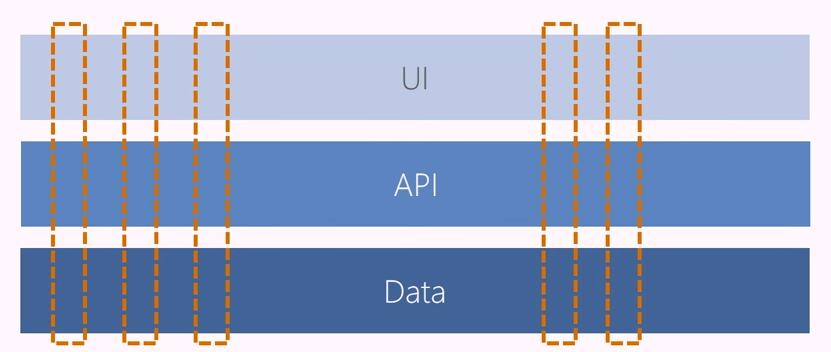
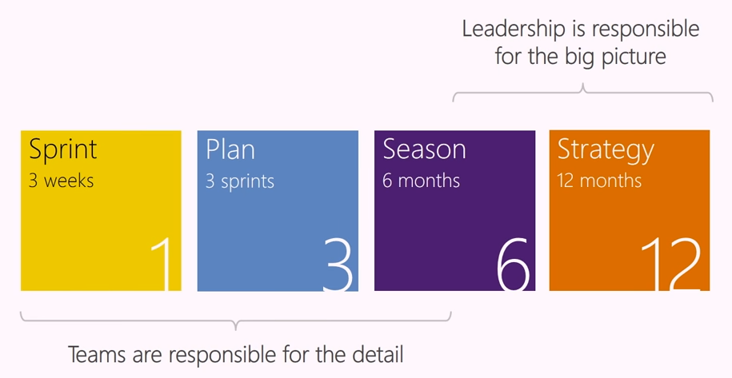

# Agile principles in practice
> By: Aaron Bjork

Aaron Bjork discusses how we incorporate Agile principles and what that looks like in practice. Everything about how we manage teams, roles, planning, sprints, and flow has brought improvement to the software we build and use daily that customers can depend on.

 
> [!VIDEO https://www.youtube.com/embed/-LvCJpnNljU]

## Introduction to VSTS and TFS

The Visual Studio Team Services (VSTS) and Team Foundation Server (TFS) team is made of about 800 people that contribute to either the subscription-based cloud service (VSTS) or the on-permise product (TFS). VSTS and TFS are platforms for software development teams to collaborate, plan, write, build, test, and deploy their code.

The VSTS development teams work in 3-week sprints, shipping at the end of each sprint. About 3-4 times a year, the updates are packaged and applied to TFS via updates.

## Before vs After

Below you can find some of the changes our development team made as we made the leap to apply Agile practices to our workflow.

| Before                                    | After                                                                                                 |
|-------------------------------------------|-------------------------------------------------------------------------------------------------------|
| 4-6 month milestones                      | 3-week sprints
| Horizontal teams                          | Vertical teams
| Personal offices                          | Team rooms
| Long planning cycles                      | Continual Planning and learning
| PM, Dev, Test                             | PM and Engineering
| Yearly customer engagement                | Continual customer engagement
| Feature branches                          | Everyone in master
| 20+ person teams                          | 8-12 person teams
| Secret roadmap                            | Publicly shared roadmap
| Bug debt                                  | Zero debt
| 100 page spec documents                   | Specs in PPT
| Private repositories                      | Open source
| Deep organization hierarchy               | Flattened organization hierarchy
| Success is a measure of install numbers   | User satisfaction determines success
| Features shipped once a year              | Features shipped every sprint

## Instrumental changes

There are four key changes that we decided to make to really make our development and shipping cycles efficient and healthy.

### We changed our **culture**

_"Culture eats strategy for breakfast."_ - Peter Drucker

We've found that the key motivating factors for people are **autonomy, mastery,** and **purpose.** At Microsoft, we are looking for ways to bring those factors to our PMs, developers, and designers so that they feel empowered to build the right things.

Two items we heavily consider for our approach are **alignment** and **autonomy**:

- Alignment: Happens from the top down, ensures people understand what we're going to do and that people are lined up on business goals, aspects, and why we're trying to do what we're doing
- Autonomy: Happens from the bottom up, ensures people come into work every day and feel like they have a big impact on day-to-day activities and decisions

There is a delicate balance between the two - too much alignment and a negative culture gets created where people punch in, punch out, because that's what the "manual" says to do; too much autonomy and there's no structure or direction, leading to inefficient decisions and plans.

In order to balance the two, we try to implement something we call "Aligned Autonomy".

### We changed our approach to **teams**

We started thinking about teams more than individuals in VSTS. We organized people and teams into two groups: PMs and engineers.

- PMs: Responsible for what we're building and why we're building it
- Engineers: Responsible for how we're building it and ensuring we build it with quality

#### The characteristics of our teams:

- Cross discipline
- 10-12 people
- Self-managing
- Clear charter and goals for 12-18 months
- Physical team rooms
- Own features in production
- Own deployment of features

#### Makeup of teams:

Before, teams would be horizontal - they would either cover **all** UI, **all** data, **all** API, etc. But now what we want are teams that own their area end-to-end in the product. We implement strict guidelines in certain tiers to ensure uniformity across the product among teams.

We strive for vertical teams: 

#### Self-forming teams

Every ~18 months we practice what we call the "yellow sticky exercise". This is an activity in which developers are able to choose which areas of the product they're interested in and would like to work on for the next couple of planning periods. This exercise provides the teams with autonomy - able to choose what they work on, and also helps the organization with alignment as it makes sure we have balance among the teams.

About 80% of the people in this exercise end up going back to the team they currently work for, but they go back feeling empowered that they had a choice.

#### Transparency and accountability

At the end of every sprint, every team sends a mail saying what they've accomplished in the previous sprint, and what they plan on doing in the next sprint.

### We changed how we **plan** and **learn**

_"Plans are worthless, but planning is everything"_ - Dwight Eisenhower

Our planning is broken down as follows:

- Sprints (3 weeks)
- Plans (3 sprints)
- Seasons (6 months)
- Strategies (12 months)

With engineers and teams responsbile mostly for Sprints and Plans, and leadership responsible for Seasons and Strategies.

We've found that this planning structure helps us maximize our **_learning_** while we do our planning. We're able to get feedback, deploy, find out what customers want and actually implement those things quickly and efficiently.

### Created new ways to **stay healthy**

Before, we would let code bugs build up until the end of a code phase (the "code complete). We would then discover them, work on fixing them, rinse and repeat. This created a "roller coaster" of bugs, and as the number of bugs dropped, so did team morale as they did nothing but work on bug fixes instead of implementing new and fun features.

Now, we implement what we call a "bug cap". A bug cap is calculated by the following formula:

- `# of engineers x 5 = bug cap`

If a team's bug count exceeds the bug cap at the end of a sprint, they stop working on new features until they are back down under their cap. A version of paying down their debt as they go.

#### Shielding distractions

Teams have come up with their own way to provide focus and assist with an interrupt culture in the form of bugs and live-site incidents. 

Teams will self-organize itself each sprint into two distinct teams: **Features (F team)** and **Shielding (L teams)**. The F-team works on commited features and the L-team deals with all live site issues and interruptions. The rotating cadence is established by the team and it allows for members to plan activities outside of work mcuh easier.

## Four key takeaways

1. Take agile science seriously, but don't be overly prescriptive. Agile can become too strict, let it grow like a mindset or culture.
2. Stop celebrating activity and start celebrating results. Lines of code shouldn't outweigh functionality deployments.
3. You can't cheat shipping. Until you get into the mindset of updating services/products at the end of Sprints, you won't find all of the work that needs to be done. Shipping every Sprint helps establish a rhythm and cadence.
4. **_Build the culture you want and you'll get the behavior you're looking for_**

> TODO: Can you help me update this with Aarons info below? @Samgu

|             |                           |
|-------------|---------------------------|
||Kim leads the analytical team on the Tools for Software Engineers team. The focuses lies on helping development teams to speed up their development process(es) while maintaining or increasing product quality and reliability. |