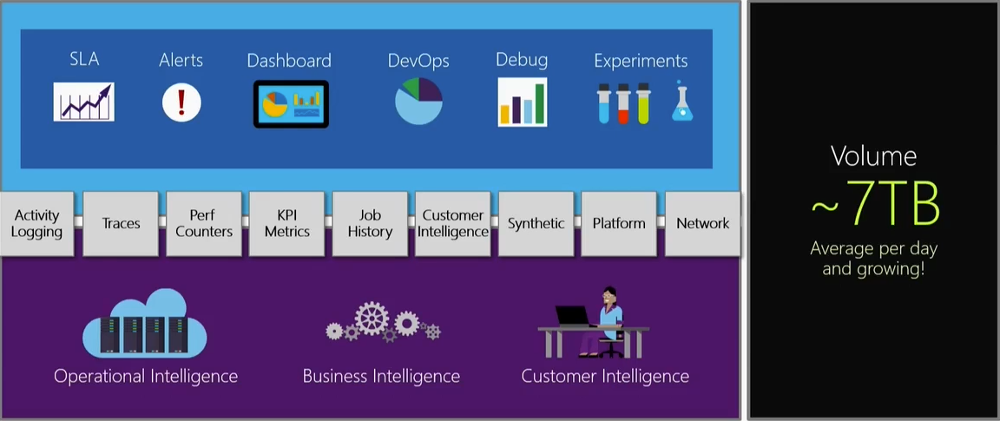

# Live site culture and site reliability
> By: Tom Moore

> [!VIDEO https://www.youtube.com/embed/UCP-e3sKL8k]

## Live Site Culture
Live site culture is more important than ever. Now, customers can move across service providers fairly easily nowadays with the Cloud and Internet-based services, and this amplifies the importance of trust between you and your customers. It's important that your live site is always available and as-promised to your customers. 

Below you'll find the key factors of our Live Site Culture.

### Live Site First

Put live site experience first is integral to a successful platform. You can't put all of your focus on new, shiny features and disregard the avenue in which those features are presented to your users.

### Feel the Pain

It's important that developers fully own and take responsibility for their areas and the conflicts or issues that may arrive there. When there is a live-site incident, the developers are going to be much more invested if their phone starts to ring in the middle of the night than if they just get an email sent to their inbox. 

An important consideration here is that there must be a balance in the urgency and frequency of alerts. You want your teams to feel responsible and motivated but not get spammed so much at weird times that they feel distanced.

### Drive with data

Deeply embedded in good live-site culture is good data. Having good data off and online about the live-site that you can query is important for not just issue resolution but also for knowing the state of the environment during performance issues or outages. Build up telemetry for your live-site, create and manage alerts, really "turn the lights on" in production. 

Kusto is a big log analytics system that brings in a lot of data that runs queries in seconds, as opposed to hours with our old SQL based database queries.

### Root cause is key

Good data will help tremendously with this component of good live-site culture; digging in to find the root cause of issues or outages has many benefits to your team and also to your site.

For instance, restarting everything may fix the problem, but if you don't dive in and find out the state of things when conflicts occur, you can't find the root cause and fix it from happening again. It's also important to be able to tell users exactly what happened and give them the confidence that you've fixed the underlying issue.

### Detect before customers

It's embarassing when you're running a service and you're not aware of an issue before a customer escalates it to you.

We needed a 24x7 monitoring system that ran reliably all the time, espeially when the service was down or misbehaving. Our telemetry system collects rich data for both real-time and latent analysis.
    

### Cloud

Devs can deploy things easily directly to the live site which brings them closer to the live site and makes devs helping with live site issues easier.

### Learn once and share

Pull all of the learnings from issues. Reflect on things other than the technical aspects of issues. How quickly did you respond? What steps did you take to fix the problem? 

### Lock it down

### Drive down time-tos

We value transparency and strive to send incident communications to our customers in rea-time via our blog, service status, and internal email. We've developed automation tooling to reduce time-to-notify (TTN).

Back in 2013 it would take us ~45 minutes to notify users of issues or outages and sometimes, by then, the problem would be fixed.

In 2016 we started using VSTSMC tool to get security stored passwords with 3 editing experiencing, bringing down our TTN to around 30 minutes. However even that was slow where data was duplicated.

In 2017 we adopted One touch comms. Single click to post updates to all 3 communication channels. We built a communication tool that takes in incident information from our incident system (what we call ICM) and that tool blasts out our service status, public blog, and internal customers via their preferred method of communication. This brought our TTN down to 15 or faster. It may not be as rich but we can do it very quickly.

### Be open and learn

### Automate and survive

When you're being successful and you're growing, automation will save you a lot of time and headaches. Even small things like rotating secrets can get out of hand when you're scaling out.

### Config as code

## Responding to live site alerts

    TODO: Image at 1:28:00

## Realtime incident coordination (1:31:30)