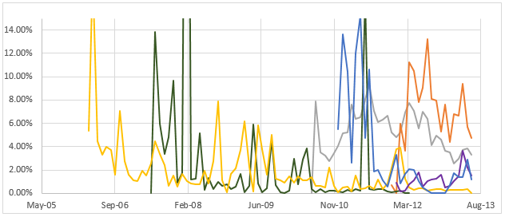

# Using a simple code churn metric to find software bugs
> By: Hitesh Sajnani

A common problem in software engineering is understanding how to evolve
large software projects, particularly when trying to maintain,
modernize, or refactor. Often the software source code base has grown
over time and it is not obvious where to invest to improve quality and
reduce technical debt. New source files are added to extend the
functionality and existing files are changed to accommodate new features
or to fix bugs. But what is the impact of these modifications on the
system?

It would be useful to have a heuristic to identify an 80% quality
improvement for 20% of the potential effort.

## Use source history to identify technical debt
How can we monitor the quality of our system as it evolves and we
refactor? This article proposes a metric called Active files to capture
this evolutionary behavior of a system and also describe its
relationship with bugs, changes and size of the system \[1\].

## Newly added files mask dependencies and impact code understanding
As systems grow, it becomes harder for developers to understand their
architecture. New developers struggle to figure out what the codebase
contains and where they should put their changes. Often, developers will
correct a symptom instead of a root-cause and inadvertently reduce
long-term maintainability. They introduce errors because they are not
aware of other relevant code.

### Avoid unexpected consequences
Under such conditions, how can we scale gracefully? If the new feature
needs to adjust many places in the codebase, it will be difficult for a
developer to make changes without side-effects leading to bugs. The more
places need to be touched, the more the developer will need to learn in
order to implement a feature properly and the longer the work will take.

### Strive for single responsibility
On the other hand, if the newly added files focus on a single
responsibility and are architecturally decoupled from the rest of the
system, the chances of developers having to modify them in future are
usually lower. In such cases, although there may be many thousands of
files present in the system, only a small subset of them might be in
need of continuous change, and therefore remain permanently ‘active’.
This is the promise of microservices architecture.

### Keep few files active and minimize work in process
Having a small set of active files creates a more stable system.
Developers do not have to manage too many assumptions or spend extra
effort rediscovering existing assumptions. For the same reason, keep
this set of active files small even with a growing code base.

### A missing metric to understand churn
Creating a metric for monitoring the evolution of the system will have
two advantages:

- We can govern the risk of side effects from unwanted complexity.
- We can determine where the code base most needs to be refactored to improve quality.

In this research, we experimented with the practical value of this
metric.

## Defining active and recurrently active files
Active files represent only the subset of total files in the system that
continue to change over time. A file f is defined to be active at date d
with an activity window t (number of days) if it has changed on date d
and at least once between d-t and d-1. This is shown visually in Figure
1 where we use ℂ*x* to denote the set of files changed on a given date.

We extend this definition to recurrently active files. A file is
recurrently active with periodicity n if it is active and has also
changed at least once in each of the previous n active windows. For
example, as visually depicted in Figure 2, file f is active at date d,
with activity window t, and recurrence of 5.

## Compute active files as a proportion of the code base
Keeping the above definitions in mind, we can classify any file in the
codebase as active, recurrently active or stable. The ratio of the
number of active files to the total number of files comprising the
product can be determined at any point in time.

We computed the active files metric on six large software systems within
Microsoft ranging from products to services to understand their
relationship with various factors related to the evolution of a software
system (e.g., size and growth, changes, defects, etc.).

## Active files propagate bugs
In these systems, we found that **active files constitute only between
2%-8% of the total system size, contribute 20%-40% of system file
changes, and are responsible for 60%-90% of all bugs**. The majority,
65%-95%, of the active files are architectural hub files which change
due to feature addition as opposed to fixing defects.

Figure 3 shows the percent size of active files to total files in a
software system throughout its lifecycle for several software projects
we studied.

## Why monitor active files?
Development teams might be interested in measuring and monitoring their
active file set for three primary reasons.

### Program comprehension
Active files are typically a small subset of all source files but they
have the most impact on a system’s evolution. By understanding the role
of active files in the system first, developers might be able to quickly
gain a good understanding of the underlying architecture. Although far
from filling the needs of advanced development work, this knowledge is
critical for initial comprehension of the system.

### Managing evolution
While growing code bases is a condition that is difficult to avoid,
writing code in a way that tends to bring closure to files quickly can
certainly help in scaling up evolution in a more manageable way.
Tracking active files and ensuring that they are strictly managed,
rigorously tested, and well-designed is one way to have high stability
and low defect density in a system.

### Code reviews and testing based on high risk
If changes to active files are as bug-prone as we think they are,
keeping that set in mind while verifying the code change will allow us
to apply our resources more efficiently. Developing light-weight smart
test procedures that take active files into account would be an
excellent way for automated tests to cover the most important areas of
code first. Moreover, a code review system where active files are
flagged can be useful.

## References
\[1\] [Lukas Schulte, Hitesh Sajnani, Jacek Czerwonka: Active Files as a
Measure of Software Maintainability.
ICSE 2014: 34-43](http://dl.acm.org/citation.cfm?doid=2591062.2591176)

|             |                           |
|-------------|---------------------------|
||Hitesh is currently a Software Engineer in the Tools for Software Engineering (TSE) group at Microsoft. Before joining TSE, Hitesh graduated with a PhD in Informatics from the School of Information and Computer Science, University of California Irvine. His dissertation topic was Large-Scale Code Clone Detection.|