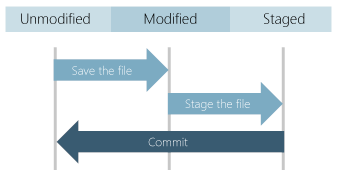

# What is Git?
> By: Kayla Ngan

Git is the most commonly used version control system today and is
quickly becoming *the* [standard for version
control](http://stackoverflow.com/research/developer-survey-2015#tech-sourcecontrol).
Git is a distributed version control system, meaning your local copy of
code is a complete version control repository. These fully-functional
local repositories make it is easy to work offline or remotely. You
commit your work locally, and then sync your copy of the repository with
the copy on the server. This paradigm differs from centralized version
control where clients must synchronize code with a server before
creating new versions of code.

Git’s flexibility and popularity make it a great choice for any team.
Many developers and college graduates already know how to use Git. Git’s
user community has created many resources to train developers and Git’s
popularity make it easy to get help when you need it.  Nearly every
development environment has Git support and Git command line tools run
on every major operating system.

### Git basics
Every time you save your work, Git creates a commit. A commit is a
snapshot of all your files at a point in time. If a file has not changed
from one commit to the next, Git uses the previously stored file. This
design differs from other systems which store an initial version of a
file and keep a record of deltas over time.

Commits create links to other commits, forming a graph of
your development history . You can revert your code to a previous
commit, inspect how files changed from one commit to the next, and
review information such as where and when changes were made. Commits are
identified in Git by a unique cryptographic hash of the contents of the
commit. Because everything is hashed, it is impossible to make changes,
lose information, or corrupt files without Git detecting it.

#### Branches
Each developer saves changes their own local code repository. As a
result, you can have many different changes based off the same commit.
Git provides tools for isolating changes and later merging them back
together. Branches, which are lightweight pointers to
work in progress, manage this separation.  Once your work created in a
branch is finished, merge it back into your team’s main (or master)
branch.

#### Files and commits
Files in Git are in one of three states: modified, staged, or committed.
When you first modify a file, the changes exist only in your working
directory. They are not yet part of a commit or your development
history. You must *stage* the changed files you want to include in your
commit (you can omit files that you wish to commit separately). The
staging area contains all changes that you will include in your next
commit. Once you’re happy with the staged files, *commit* them with a
message describing what changed. This commit becomes a part of your
development history.

Staging lets you pick which file changes to save in a commit so you can
break down large changes into a series of smaller commits. When you
reduce the scope of your commits, it’s easier to review the commit
history to find specific file changes.

### Benefits of Git
#### Simultaneous development
Everyone has their own local copy of code and can work simultaneously on
their own branches. Git works when you’re offline since almost every
operation is local.

#### Faster releases
Branches allow for flexible and simultaneous development. The main
branch contains stable, high-quality code from which you release.
Feature branches contain work in progress, which you merge into the main
branch upon completion. By separating your release branch from
development in progress, you can manage your stable code better and ship
updates more quickly.

#### Built-in integration
Due to its popularity, Git is integrated into most tools and products.
Every major IDE has built-in Git support, and many tools that allow you
to manage continuous integration, continuous deployment, automated
testing, work item tracking, metrics, and reporting feature integration
with Git. This integration simplifies your day to day workflow.

#### Strong community support
Git is open-source and has become the de facto standard for version
control, and there is no shortage of tools and resources available for
your team to leverage. The volume of community support for Git compared
to other version control systems makes it easy to get help when you need
it.

#### Git works with your team
Using Git with a source code management tool can increase your team’s
productivity by encouraging collaboration, enforcing policies,
automating processes, and improving visibility and traceability of work.
You may choose individual tools for version control, work item tracking,
and continuous integration and deployment. Or, you can choose a solution
like [Visual Studio Team Services](https://visualstudio.microsoft.com/team-services/) that lets you
manage all of these tasks in one place.

#### Pull requests
Use [pull requests](git-pull-requests.md) to
discuss code changes with your team before merging them into your main
branch. The discussions you have in pull requests are invaluable to
ensuring code quality and increase knowledge across your team. Visual
Studio Team Services offers a rich pull request experience where you can
browse file changes, leave comments, inspect commits, view builds, and
vote to approve the code.

#### Branch policies
Your team can configure Visual Studio Team Services to enforce
consistent workflows and process across your team. Set up [branch policies](https://docs.microsoft.com/vsts/git/branch-policies)to
ensure that pull requests meet your requirements before completion.
Branch policies protect your important branches by preventing direct
pushes, requiring reviewers, and ensuring clean builds.

 Get started with unlimited free private Git repos in [Visual Studio Team Services](https://visualstudio.microsoft.com/team-services/git/).

|             |                           |
|-------------|---------------------------|
| |Kayla Ngan is a Program Manager for Git and Version Control on the Visual Studio Team Services and Team Foundation Server team at Microsoft. |