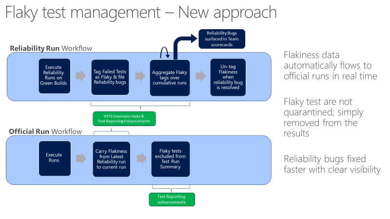

# Eliminating Flaky Tests
> By Munil Shah

The next part of ensuring ‘Master is Shippable’ was eliminating flaky
tests. A test is flaky when it passes sometimes and fails sometimes,
without any noticeable change in the code, tests, or environment. Some
tests fail, then you re-run them and they pass. They are useless tests
and if left uncontrolled can completely destroy the value of an
automated regression suite. The primary benefit of having automated
tests is that they detect bugs by acting as regression tests.

On the flip side, having a great bug detection or deterministic quality
signal means you can find bugs early in the cycle. It increases your
confidence in making big changes. Flakiness can plague any kind of test,
but it’s particularly prone to affect tests with a broad scope,
functional tests.

> [!VIDEO https://www.youtube.com/embed/Q4c5cvt1b3k]

We needed a robust process to manage test flakiness.

## Our First Attempt to Remove Flaky Tests
Initially, we continued to run our old tests at the same time as the new
L2 tests. These are new functional tests and we wanted to make sure they
are highly reliable from the beginning. We would take a good build and
run tests in a tight loop 500 times, called a reliability run. If a test
fails at any time, we would declare it as flaky and file a test
reliability bug. These bugs show up on the team scorecard and the team
would fix those bugs. With a significant commitment from the leadership
to track and fix flaky tests with this approach, we were able to improve
the reliability of the L2 tests well over 90%.

It turns out 90+% reliability is good, but it is nowhere close to
sufficient. We needed tests that pass 100%. There were a couple of
reasons why this system didn’t get us close to 100%. First, the signal
coming out of the reliability run is not used immediately to filter out
tests. Instead it relied on engineers to watch for reliability bugs and
fix them. Second, the whole process was manual. The reliability runs
were done weekly and it required manual action to identify failures and
file bugs.

## Flaky Test Management – New Approach
We built a new system that addressed all these drawbacks.

We used the reliability data automatically and immediately in the
official test run. The system would automatically file bugs for flaky
tests and the engineers were expected to fix those bugs quickly. The
flakiness data immediately appeared in team scorecard. The official run
didn’t remove flaky tests from the run, it simply filtered them out from
the results. This was a key innovation. We didn’t quarantine the tests,
we quarantine the results, which was much easier to do.

The new approach worked. The CI runs became very green. The system
tracks resolution time on flaky test bugs and we fixed these bugs with
an average resolution time of 3.75 days. The system runs itself without
much manual intervention. And most importantly, the team trusts the CI
signal. When there is failure, the team immediately jumps on it to debug
the problem, because now it is likely a bug in the code that just got
merged and not a problem with the tests.

Below is what our CI pipeline looks like in action. Each column
represents a build and each row is a suite of tests we run on the CI
build. As you can see, it remains pretty green with runs passing 100%
vast majority of the time. There are occasional red cells, but the pass
rate is typically 99+%. It doesn’t take too long to investigate the
failures and take actions on them. The failures are removed fairly
quickly.

|             |                           |
|-------------|---------------------------|
||As Partner Director of Engineering in Microsoft's Cloud and Enterprise division, Munil Shah leads engineering for Visual Studio Team Services and TFS products. Munil has over 20 years of experience building large scale software and distributed services. Prior to his current role, he held various engineering leadership positions Bing Advertising and Windows groups at Microsoft. He is passionate about leading engineering teams through significant transformation to deliver successful solutions to customers. |