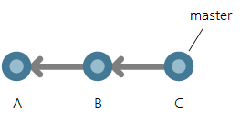
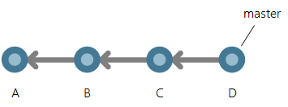
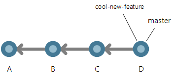
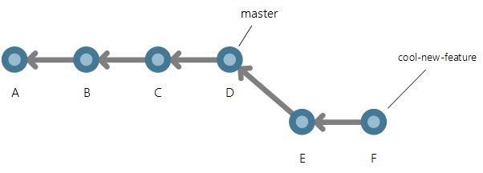
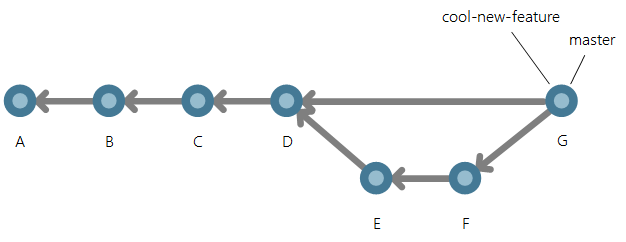
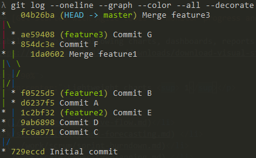

# Understand Git history
> By: Robert Outlaw

Git represents history in a fundamentally different way than centralized
version controls systems (CVCS) such as Team Foundation Version Control,
Perforce, or Subversion. Centralized systems store a separate history
for each file in a repository.  Git stores history as a graph of
snapshots of the entire repository. These snapshots—which are called
commits in Git—can have multiple parents, creating a history that looks
like a graph instead of a straight line. This difference in history is
incredibly important and is the main reason users familiar with CVCS
find Git confusing.

### Commit history basics

Start with a simple history example: a repo with 3 linear commits.

  

Commit A is the parent of commit B, and commit B is the parent of commit
C. This history looks very similar to a CVCS. The arrow pointing to
commit C is a branch. It’s named master because that’s the default name
for the mainline branch in a Git repo. Branches are pointers to specific
commits, which is why branching is so lightweight and easy in Git.

A key difference in Git compared to CVCS is that I have my own full copy
of the repo. I need to keep my local repository in sync with the remote
repository by getting the latest commits from the remote repository. To
do this, I’ll pull the master branch with the following command:

`git pull origin master`

This merges all changes from the master branch in the remote repository,
which Git names `origin` by default . This pull brought one new commit
and the master branch in my local repo moves to that commit.

### Understand branch history

Now I want to make a change to my code. It’s common to have multiple
active branches where you’re working on different features in parallel.
This is in stark contrast to CVCS where new branches are heavy and
rarely created. The first step is to checkout to a new branch using the
following command:

` git checkout -b cool-new-feature`

This is a shortcut combining two commands:` git branch cool-new-feature`
to create the branch followed by `git checkout cool-new-feature` to
begin working in the branch.

Two branches now point to the same commit. I’ll make a few changes on
the `cool-new-feature `branch in two new commits, E and F.

  

My commits are reachable by the `cool-new-feature` branch since I made
them in that branch. I’m done with my feature and want to merge it into
the master branch. To do that I’ll use the following command:

`git merge cool-feature master`

The graph structure of history becomes visible when there’s a merge. Git
creates a new commit when I merged my branch into another branch. This
is a merge commit. There aren’t any changes included this merge commit
since I didn’t have conflicts. If I had conflicts, the merge commit
would include the changes needed to resolve those conflicts.

### History in the real world

Here is an example of Git history that more closely resembles code in
active development on a team. There are three people who merge commits
from their own branches into the master branch around the same time.

Now that you understand how branches and merges create the shape of the
graph, this shouldn’t be too scary\!

Learn more about Git history in our [Team Services Git tutorial](https://www.visualstudio.com/en-us/docs/git/tutorial/history)

 Get started with unlimited free private Git repos in [Visual Studio Team Services](https://www.visualstudio.com/team-services/git/).

|             |                           |
|-------------|---------------------------|
||Robert is a content developer at Microsoft working on Visual Studio Team
Services and Team Foundation Server.|