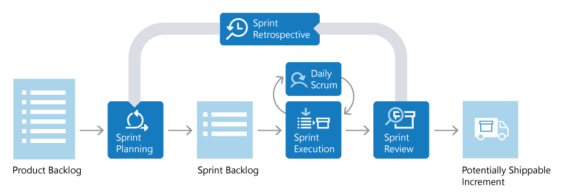
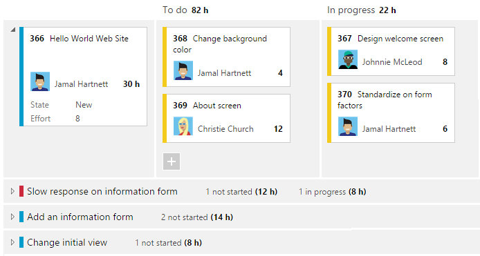

# What is Scrum
> By: Gregg Boer

Scrum is a framework used by teams to manage their work. Scrum
implements the principles of
[Agile](what-is-agile.md) as a concrete
set of artifacts, practices, and roles.

This article provides a basic description of Scrum. At the end, you’ll
find helpful resources if you want to dig in more.

## The Scrum lifecycle
The following diagram details the Scrum lifecycle. Scrum is iterative.
The entire lifecycle is completed in fixed time-period called a Sprint.
A Sprint is typically 2-4 weeks long.

## Scrum Roles
Scrum prescribes three specific roles…

#### Product Owner
Responsible for what the team is building, and why they’re building it.
The product owner is responsible for keeping the backlog up-to-date and
in priority order.

#### Scrum Master
Responsible to ensure the scrum process is followed by the team. Scrum
masters are continually on the lookout for how the team can improve,
while also resolving impediments (blocking issues) that arise during the
sprint. Scrum masters are part coach, part team member, and part
cheerleader.

#### Scrum Team
These are the individuals that actually build the product. The team owns
the engineering of the product, and the quality that goes with it.

## Product Backlog
The Product Backlog is a prioritized list of value the team can deliver.
The Product Owner owns the backlog and adds, changes, and reprioritizes
as needed. The items at the top of the backlog should always be ready
for the team to execute on.

## Sprint Planning and Sprint Backlog
In Sprint Planning, the team chooses the backlog items they will work on
in the upcoming sprint. The team chooses backlog items based on priority
and what they believe they can complete in the sprint. The Sprint
Backlog is the list of items the team plans to deliver in the sprint.
Often, each item on the Sprint Backlog is broken down into tasks. Once
all members agree the Sprint Backlog is achievable, the Sprint starts.

## Sprint Execution and Daily Scrum
Once the Sprint starts, the team executes on the Sprint Backlog. Scrum
does not specify how the team should execute. That is left for the team
to decide.

Scrum defines a practice called a Daily Scrum, often called the Daily
Standup. The Daily Scrum is daily meeting limited to 15 minutes. Team
members often stand during the meeting, to ensure it stays brief. Each
team member briefly reports their progress since yesterday, the plans
for today, and anything impeding their progress.

To aid the Daily Scrum, teams often review two artifacts:

#### The Task Board
Lists each backlog item the team is working on, broken down into the
tasks required to complete it. Tasks are placed in To Do, In Progress,
and Done columns based on their status. It provides a visual way of
tracking progress for each backlog item.

#### The Sprint Burndown
A graph that plots the daily total of remaining work. Remaining work is
typically in hours. It provides a visual way of showing whether the team
is “on track” to complete all the work by the end of the Sprint.

## Sprint Review and Sprint Retrospective
At the end of the Sprint, the team performs two practices:

#### Sprint Review
The team demonstrates what they’ve accomplished to stakeholders. They
demo the software and show its value.

#### Sprint Retrospective
The team takes time to reflect on what went well and which areas need
improvement. The outcome of the retrospective are actions for next
sprint.

## Increment
The product of a Sprint is called the “Increment” or “Potentially
Shippable Increment”. Regardless the term, a Sprint’s output should be
of shippable quality, even if it’s part of something bigger and can’t
ship by itself. It should meet all the quality criteria set by the team
and Product Owner.

## Repeat. Learn. Improve.
The entire cycle is repeated for the next sprint. Sprint Planning
selects the next items on the Product Backlog and the cycle repeats.
While the team is executing the Sprint, the Product Owner is ensuring
the items at the top of the backlog are ready to execute in the
following Sprint.

This shorter, iterative cycle provides the team with lots of
opportunities to learn and improve. A traditional project often has a
long lifecycle, say 6-12 months. While a team can learn from a
traditional project, the opportunities are far less than a team who
executes in 2-week sprints, for example.

This iterative cycle is, in many ways, the essence of Agile.

Scrum is very popular because it provides just enough framework to guide
teams, while giving them flexibility in how they execute. Its concepts
are simple and easy to learn. Teams can get started quickly and learn as
they go. All of this makes Scrum a great choice for teams just starting
to implement [Agile](what-is-agile.md) principles.

## Other Scrum Resources
[ScrumAlliance.org](http://www.ScrumAlliance.org "Scrum Alliance")

[Scrum.org](http://www.scrum.org "Scrum.org")

 Get started with free agile tools in [Visual Studio Team
Services](https://www.visualstudio.com/team-services/agile-tools).

|             |                           |
|-------------|---------------------------|
||Gregg Boer is a Principal Group Program Manager at Microsoft. He works in the Microsoft’s Visual Studio Cloud Services (VSCS) division. A big believer in the benefits of Agile, Gregg drives the vision for Agile management solution provided by Microsoft’s Visual Studio Team Services and Team Foundation Server products.|