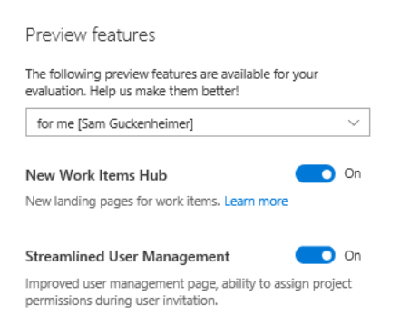
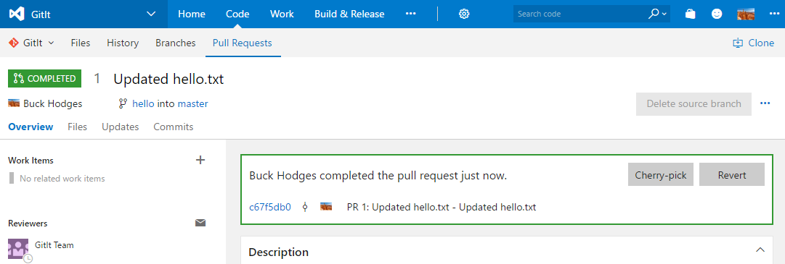
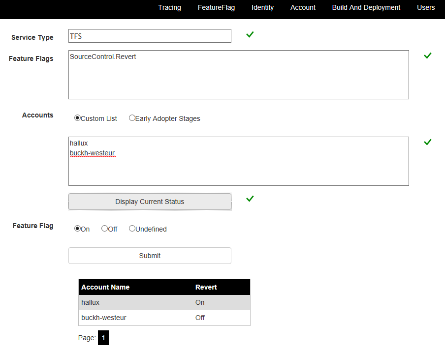

# Progressive Experimentation with Feature Flags
> By: Buck Hodges

One of the things that we needed to do as part of our cloud service
journey was to be able to control disclosure of features. This was
something we never had in the on-prem product.

> [!VIDEO https://www.youtube.com/embed/ed3ziUDq_n0]

## Decouple deployment and exposure
If I want to go to announce something at a conference, how do I allow
the engineering team to go build it, test it, and deploy it, all without
showing it to the whole world far ahead of the event? We have a couple
conferences that we tend to target with new functionality, Build and
Connect. Feature flags provide this kind of control.

## Flags provide runtime control down to individual user
Flags also provide granular control all the way down to the individual
user. I can make changes without a redeployment. When I make a change to
a flag, the whole system knows about it. There are a set of
notifications that go out. All the services react to it. It’s controlled
by a PowerShell script or web UI. After a deployment’s done, we may go
turn on a feature flag. That can all be fully automated or somebody can
turn on a flag for a personal or customer account.

My best example of using the granularity is SSH. When we rolled out SSH,
we had a set of feature flags that controlled it. Not everybody wants to
use SSH. We’ve got a standard process to turn feature flags on for sets
of customers but sometimes you need to do something different for the
feature because of the audience. In this case I literally wrote a blog
post and said, “Hey, if you want SSH turned on, let me know.” Every time
somebody sent me an email, I’d go turn the feature flag on.

## Support early feedback, experimentation
The whole purpose here is that we want to be able to do early
experimentation. If you have seen some of our features very early on,
when they’re still pretty rough, that’s because you’re in an early stage
of feature flags. Getting this early feedback has been incredibly
valuable to us. We can expose something very early on knowing that it’s
not fully baked, get feedback, iterate without waiting until it’s all
done and goes global.

## Quick off switch
Sometimes it’s very helpful to be able to turn something off. Let’s say
that you develop new features, behind a feature flag, you turn it on,
something goes wrong. Whatever that thing is, you’ve got a quick way
out. You can always turn it off and that turns out to be very valuable.
When we use feature flags for architectural or infrastructural changes,
flags let us test changes out incrementally and turn them off if
something goes wrong at any point in time.

## Standard stages
To turn on feature flags, we have a standard rollout process that we
use. We call it stages. Note that we have two separate concepts; [rings and stages](https://youtu.be/QP_u4ipP2SU). Rings are for deployment,
stages are for feature flags.  

Stages are all about disclosure or exposure. So, for example, our first
stage is our team’s account (mseng) and our personal accounts. There’s a
lot of stuff running on service right now that you don’t see because the
only place flags are turned on is this first stage. That way our team
can use it, go experiment with it. Select customers have opted into our
second stage of feature flags.

## Opt in
In the VSTS web UI, there is a preview panel that you can get to from
your avatar: click on your avatar and click on preview features. Those
are all feature flags. But in the web UI, it doesn’t look that way. It
just looks like a switch. For example, you want to turn on the new
release editor and click the switch on. You actually just flipped a
feature flag yourself.



And then of course we can turn things on for every customer when we’re
ready to roll it out globally. We have a great deal of control. I can
control it from the individual user to global and everything in between.
This flexibility has proven immensely valuable over time.

## Use Flags with Telemetry
When you have feature flags, you’ve got a way to incrementally expose
things. That’s going to have the most value if you’ve got the right
monitoring in place. The important question is: When I turn this feature
on, what are the important metrics I should look at to know if it’s
truly healthy? The avoidance of failure is not success. Without the
right monitoring, it’s “Oh I turned it on, nothing bad happened.”

## Example
Let’s take a look at a quick example. We added a couple buttons here
*Cherry-pick* and *Revert* in the pull request UI. We did this about a
year ago under feature flags, and it makes for a nice example.



## Defining Feature Flags
Let’s take the Revert button. How do we define a feature flag for that?
We actually have an XML file that defines all the feature flags. There’s
one file per service. That ensures that if a team ends up with their
section getting really long, it’s clear it’s time to clean them up.
They’ll delete old flags, because there’s a natural motivation to
control the size of that file.

```XML
<?xml version="1.0" encoding="utf-8"?>
<!--
  In this group we should register TFS specific features and sets their states.
-->
<ServicingStepGroup name="TfsFeatureAvailability" … >
  <Steps>
    <!-- Feature Availability -->
    <ServicingStep name="Register features" stepPerformer="FeatureAvailability" … >
      <StepData>
        <!--specifying owner to allow implicit removal of features -->
        <Features owner="TFS">
           <!-- Begin TFVC/Git -->
           <Feature name="SourceControl.Revert" description="Source control revert features" />
```

Having a common server framework makes for a lot of reuse and economies
of scale across the whole team. In order to use a feature flag, I just
go add it to add it to an XML file. The rest of it is handled for me. I
get the entire granularity, web UI, and PowerShell, all for free.

## Checking Feature Flags at Runtime
I called my feature flag *SourceControl.Revert*. Here’s the actual
Typescript from that page a year ago, and you can see that it calls the
feature availability check.

`private _addRevertButton(): void {       if
(FeatureAvailability.isFeatureEnabled(Flags.SourceControlRevert)) {
        this._calloutButtons.unshift(            Dialogs.revertPullRequest(
              this.props.repositoryContext,
              this.props.pullRequest.pullRequestContract(),
              this.props.pullRequest.branchStatusContract().sourceBranchStatus,
              this.props.pullRequest.branchStatusContract().targetBranchStatus)
}            >{ VCResources.PullRequest_Revert_Button }
        );     } }`

There are checks in both .NET and TypeScript, so you can use the flag
either place. The code checks and says, “Hey, if this thing is enabled,
then go put this button up there and on a button click call revert. If
it’s not, then skip it.” And this one is particularly easy because the
button is either there, or it’s not. This is all I had to do as an
engineer to add this to my code.

And so how do I control it? I mentioned earlier you can control it via
PowerShell, and it’s as simple as you might expect: *get feature flag,
set feature flag,* specify user account, etc., all defined on a wiki. It
may also be part of your deployment. As part of your deployment, once a
scale unit is upgraded, you make go turn on feature flags. It is a set
of PowerShell calls that are part of that deployment, fully automated.

## Controlling Feature Flags through the Web UI
Here’s an example of using the Web UI. Here I’ve got a feature flag for
*SourceControl.Revert*. I’ve got two personal accounts listed here,
*hallux* and *buckh-westeur*. And I’ve set the state to on for hallux,
which happens to be in North Central, and I had it turned off for the
account in West Europe.



As I mentioned earlier with the SSH example, I emailed people. We also
let people know in User Voice which notified people who had voted for
it, “Hey we’ve got this feature now, send us email if you want to turn
it on.” This web UI is how we turned on the SSH feature by request (we
also didn’t have the preview panel in the product at the time).

## LaunchDarkly Provides an Extension for Feature Flags
If you want to do something today, our recommendation is to have a look
at LaunchDarkly, because they’ve built a whole service around this. They
also have features we don’t have.

## Lifecycle for Feature Flags
Many feature flags go away and the teams themselves take care of that
They decide when to go delete the feature flags. It can get unwieldy
after a while, so there’s some natural motivation to go clean it up.
It’s easy– you delete things.

There are a set of feature flags that are persistent for more
infrastructural things We tend to leave those flags in place. But
there’s a downside to that. If you have two ways for your code to run
and if you don’t test it both ways, it may not work when you go flip the
flag in the opposite direction. So, if you’re going to keep the flag,
you’ve got to make sure the code path continues to work. So there’s a
tax to keeping it beyond just the code maintenance.

## Feature Flags and Branching Strategy
By having things behind feature flags, I can have half-baked features in
Master and not affect anybody else. As long as I’ve feature flagged it
properly and turned the flag off, then I can have code in there and not
affect other people. There are still other things you have to do, you
have to think about things like security. Let’s say I add a REST
endpoint. I either have to make sure it’s fully shut off, or I’ve
thought about security for when it’s on. I don’t want to ship security
holes. Feature flags are a key part to allowing us to work in Master.

## Feature Flags to Mitigate Risk
The other thing I tell people is that if there are certain destructive
or disruptive changes you need to make, create a feature branch for a
small amount of time. One of the more extreme examples is the
transformation of going from a wide schema in work item tracking to a
long one.

In the wide schema approach, we created another column in the work item
tracking SQL tables, every time you defined a new field. In making this
change, they’re making some major changes to work item tracking, very
destabilizing changes. They made the destabilizing changes in a branch
and kept the “feature” behind a flag. My rule is such changes move up to
Master as soon as they’re not causing any harm. We couldn’t do that
without the ability to keep the unfinished feature hidden behind a
feature flag.

## Feature Flags Help Work in Master
We started working in Master before we had our testing as good as it is
today, and it was rough. (It was still much better than the old way.)
There is some tax to it, and you have to test cod both ways. However,
the advantage you get of being able to have your code go out to
production sooner and being able to iterate and experiment provides so
much value that you’re willing to pay the price. And I don’t have to ask
people to add features flags; they just do it, because there’s that much
value to them. I absolutely recommend using feature flags.
Munil Shah has a talk about not only having [everybody work in master](shift-left-make-testing-fast-reliable.md),
but do it and do it well. We started before we really fixed our testing,
and it was a bit miserable at times as the team grew quickly, but I
would absolutely recommend it.

## How to Decide Whether to use a Feature Flag
The feature teams own the decision as to whether they need a feature
flag or not for a given change. Not every change requires one, so if I
choose to change some element on a web page or whatever, it’s a judgment
call. But in the case of something like the revert feature I used as an
example here, it was it was great to be able to have that behind a
feature flag because that meant we could put the feature out in
production with controlled exposure. Teams own their feature area.
[Aaron Bjork talks about autonomy](https://youtu.be/-LvCJpnNljU), and
this is part of enabling autonomy and quite honestly, I wouldn’t be able
to know enough to give teams a better answer than they themselves could
come up with.

## Cleaning Up Unused Feature Flags
A common question is how we handle cleaning up the code after removing a
feature flag. Since you add the feature flag to the XML file, it
generates constants, including constants for C\# and TypeScript. When
you remove the flag from the XML file, there are no more constants in
the generated output. If I delete a line of XML, the build regenerates
the constants, and the deleted constants disappear so that at compile
time I get an error if anything references them. As a result, it becomes
a very clean way to take old feature flags out.

## Feature Flags Require Testing Both Settings
The teams have to think through how they need to test. You need to test
feature flags both ways. It’s up to the teams to make sure they’ve
tested the combinations. They have to keep track of it. It’s not done
centrally.

|             |                           |
|-------------|---------------------------|
||Buck Hodges is Director of Engineering for Visual Studio Team Services. He's been a member of the team since the beginning of TFS, starting as a developer on Team Foundation Version Control for the first version of TFS. He's helped lead the transition of the team to the cloud and DevOps.|