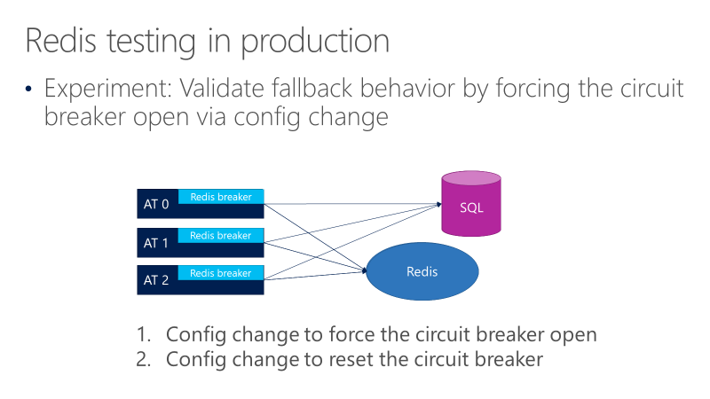

# Shift Right to Test in Production
> By: Linda Webster

## There’s No Place Like Production
This is the third and last part of the major changes we made. As you saw
earlier, we reduced our reliance on functional tests in the lab in favor
of unit tests. The flip side of that strategy was to rely a lot more on
testing in production. When it comes to cloud services, there is no
place like production.

> [!VIDEO https://www.youtube.com/embed/jFXTryMp5KY]

The full breadth and diversity of the prod environment is hard to
replicate in the lab. And the real workload of customer traffic is also
hard to simulate. Moreover, the prod environment keeps changing. It is
never constant. Even if your app doesn’t change, everything underneath
is constantly changing. The infrastructure we rely on keeps changing. So
over a period of time, we have just started doing more and more in
production.

## What We Do
When we use the term *testing in production*, we mean two things: one
set of practices that safeguards production and another set of practices
that validates the health and quality of the constantly changing
production environment.

To safeguard the production environment, we roll out changes in a
progressive and controlled manner. This is done via the ring model of
deployments and with [feature flags](progressive-experimentation-feature-flags.md).

Telemetry is test data; it is test results of the real customer
workload. We are watching failures, exceptions, performance metrics,
security events, etc. The telemetry also helps us detect anomalies.
These are tests running in production. They are L3 tests described
earlier in the test taxonomy. These tests are run against test accounts.

## Fault Injection and Chaos Engineering
We do fault injection and chaos engineering to see how the system
behaves under failure conditions. We do this to validate that the
[resiliency mechanisms](patterns-resiliency-cloud.md)
we have implemented actually work. We also want to validate that a
failure that starts in one subsystem is contained within that subsystem,
so that it doesn’t cascade and become a major outage for the entire
product. Without fault injection, it is difficult to prove that repair
work implemented from a prior incident would have the intended effect
until another incident occurs. Fault injection also helps us create more
realistic training drills for live site engineers (our “DRIs”) and be
more prepared to deal with real incidents.

## Fault Testing with a Circuit Breaker
Here is an example of testing we do in production with the help of fault
injection. Circuit breakers are difficult to validate outside of
production. With circuit breakers we are interested in two questions:

1.  When the circuit breaker opens, does the fallback work? It works
    with unit tests, but does it work in production? We use the fault
    injection to force a breaker to open and observe the fallback
    behavior.
2.  Does the circuit breaker open when it needs to? Does it have the
    right sensitivity threshold configured? We use the fault injection
    to force latency and disconnects to the dependencies and observe
    breaker responsiveness. How long does it take to open?

### Example: Testing a Circuit Breaker around Redis Cache
Let’s walk through this with the Redis circuit breaker. Redis is a
non-critical dependency in the product. It’s a distributed cache, which
means if it’s down, the system should continue to just work, the call
should fallback to source of the cache. If the Redis goes down, the
circuit breaker should break open and switch to the fallback. So that’s
the hypothesis that we are trying to test.

In picture above we have three ATs, with the breaker in front of the
call to Redis. We want to make sure when the breaker opens, the call
goes to SQL. The test forces the circuit breaker to open through a
config change, to see that the call goes to SQL. Then another test
checks the opposite config change, to close the circuit breaker and see
that the call returns back to Redis.

This test validates that fallback behavior works when the breaker opens
but doesn’t validate the configuration of the circuit breaker settings.
Will the breaker open when it needs to? To test that question we need to
simulate actual failures.

This is where the fault injection comes into play. Through a fault agent
we can introduce a fault in the call going to Redis. The fault injector
blocks Redis requests, the circuit breaker opens and we can observe that
fallback works. We can now remove the fault, the circuit breaker would
send a test request to Redis. And if the test request passes, the call
reverts back to Redis. We are able to test the sensitivity of the
breaker, whether the threshold is too high or too low or whether there
are other system timeouts that interfere with the circuit breaker
behavior.

In this example, if the breaker did not open or close as expected, it
may result in a live site incident. Without the fault injection testing,
the circuit breaker would remain untested as it’s hard to do this type
of testing in lab.

## Fault Injection Learnings
Do chaos engineering, but do it in your canary environment. For us, it
is Ring 0. This is the scale unit of our service which our own team’s
engineering system runs on. If something fails in the canary, then we
are only impacting ourselves. We are not hurting customers.

You want to automate the fault injection experiments, because these are
expensive tests and the system is always changing. You can also find
more information at .

### Business Continuity and Disaster Recovery (BCDR)
The other form of fault testing is failover testing. We have failover
plans for all our services as well as subsystems. The plan includes
several things. First, we need to clearly understand the business impact
if the service goes down. Second, we need to map all the dependencies in
terms of platform, tech and people and devising the BCDR plans. Third,
we need formal documentation of the disaster recovery procedures.
Finally, we need to regularly execute the DR drills.

### Microservice Compatibility
We are at a point where we now have 30+ microservices. And these are
deployed independently. We have a service compatibility suite today, we
run that as part of rolling CI. But it’s getting more complicated with
the microservices sprawl, with so many potential compat combinations.
We rely on the production system to do some amount of compat testing.
And L3 tests are our friends for this type of testing. The basic idea is
this. Say you have three services, S1, S2, S3. They are at version 2.0.
We are updating S1 to v3 and we want to make sure it works against the
v2 of the other services. L3s are tests we run in production against
test accounts with forward reference to services in the next ring. Each
service has a pre-flight environment where it deploys first. We run L3s
for the service with forward reference to Ring0. When the tests pass, we
promote the service to Ring0. This process can then continue as the
service is promoted through subsequent rings.

## Key takeaways
### Focus on building fast and reliable quality signal
If there is one takeaway, it is to build a fast and reliable quality
signal. A signal that your team can trust on the dev box, in the master
and in release branches. It gives engineers the confidence to make
changes knowing the system will detect bugs and it will detect soon
enough for the engineers to take actions. That trust in the quality
signal allows them to push more changes. If the signal is slow or
unreliable, it kills the entire pipeline. Flakiness makes the test
automation useless and, worse, flakiness originating in one place will
spread and infect the entire pipeline. Shift-left is not just a slogan,
it is possible to flip the test pyramid. We have done it – as shown
here.

### Combined engineering drives better accountability
We think combined engineering is a good model to drive better
accountability. End-to-end accountability drives right behavior. Reduced
handoffs improve agility. That doesn’t mean specialization is not
important. It is valuable. Just don’t build special dedicated teams for
it.

### Release to Prod is only half the job
Release to prod is just half the job. The other half is ensuring quality
at scale with real workload. No place like prod for that. The prod
environment keeps changing, so you are never done with testing in
production. This includes monitoring, fault injection, failover testing,
and all other forms.

|             |                           |
|-------------|---------------------------|
| | Linda Webster is a front-end web and WordPress developer who works on the Microsoft Visual Studio.com Team. She dabbles in web design and loves the Seattle Seahawks and zombies. |