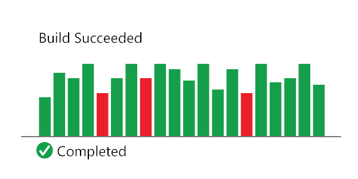

# What is Continuous Integration?
> By: Sam Guckenheimer

Continuous Integration (CI) is the process of automating the build and
testing of code every time a team member commits changes to version
control. CI encourages developers to share their code and unit tests by
merging their changes into a shared version control repository after
every small task completion. Committing code triggers an automated build
system to grab the latest code from the shared repository and to build,
test, and validate the full master branch (also known as the trunk or
main).

CI emerged as a best practice because software developers often work in
isolation, and then they need to integrate their changes with the rest
of the team’s code base.  Waiting days or weeks to integrate code
creates many merge conflicts, hard to fix bugs, diverging code
strategies, and duplicated efforts.  CI requires the development team’s
code be merged to a shared version control branch continuously to avoid
these problems.

CI keeps the master branch clean. Teams can leverage modern version
control systems such as Git to create short-lived feature branches to
isolate their work.  A developer submits a “pull request” when the
feature is complete and, on approval of the pull request, the changes
get merged into the master branch.  Then the developer can delete the
previous feature branch.  Development teams repeat the process for
additional work.  The team can establish branch policies to ensure the
master branch meets desired quality criteria.

Teams use build definitions to ensure that every commit to the master
branch triggers the automated build and testing processes.  Implementing
CI this way ensures bugs are caught earlier in the development cycle,
which makes them less expensive to fix.  Automated tests run for every
build to ensure builds maintain a consistent quality.

Read more about the Continuous Integration capabilities of
[Visual Studio Team Services](https://visualstudio.microsoft.com/team-services/continuous-integration/ "Continuous Integration with VSTS").

Learn how to set up [Continuous Integration](/vsts/pipelines/overview) for
any platform.

|             |                           |
|-------------|---------------------------|
||Sam Guckenheimer works on Microsoft Visual Studio Cloud Services, including VS Team Services and Team Foundation Server. He acts as the chief customer advocate, responsible for strategy of the next releases of these products, focusing on DevOps. He has written four books on DevOps and Agile Software practices.|